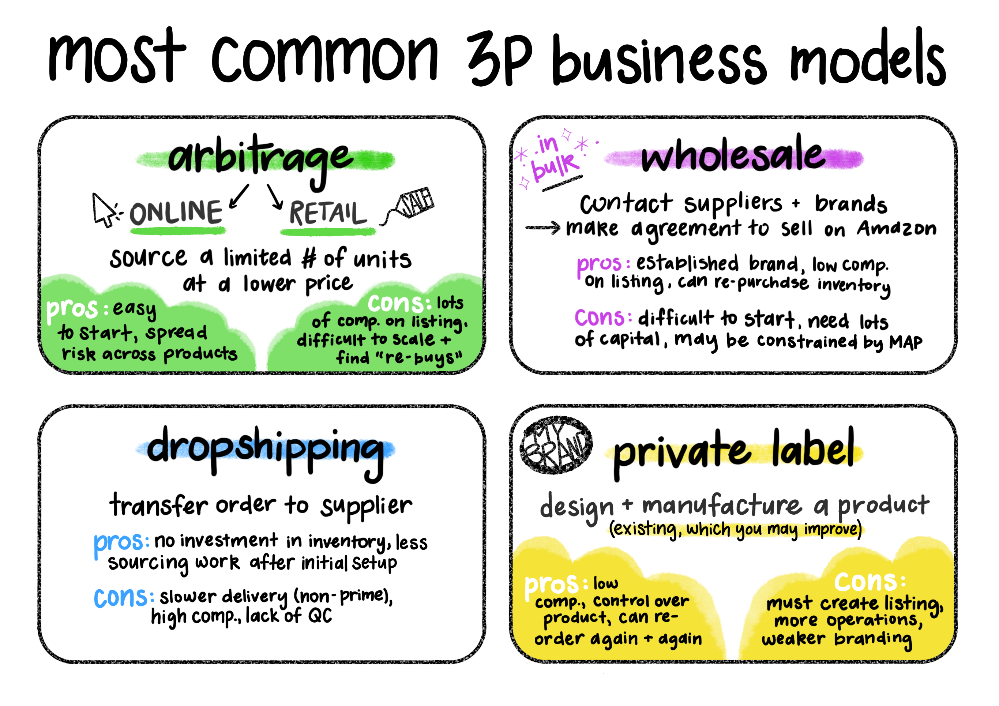
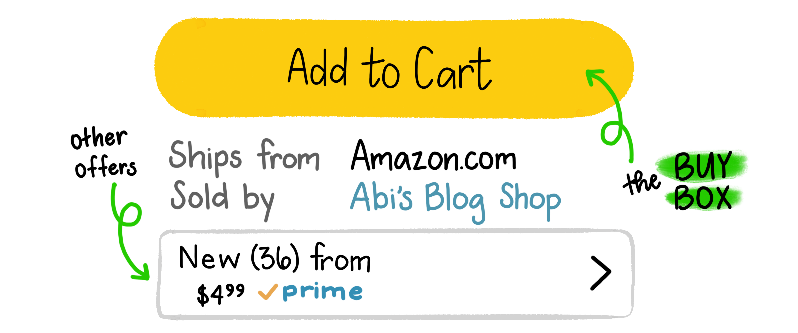

I once totaled up the number of Amazon orders my family has made in the last two decades. It was, quite frankly, excessive.

That being said, I can’t deny the perks of having so many essentials right at your fingertips—especially as someone who lives in the middle of nowhere. In rural Wyoming, Amazon Prime reliably and affordably delivers essentials to my family year-round.

**But how exactly do the magical Prime packages arrive on your doorstep so quickly? Turns out it’s more complicated than I thought. Here's my insider take on this industry.**

### **Sellers from all over the world source and list products**

The most surprising insight for me is that we are often buying from small businesses and regular people on Amazon. If you see **Ships from** `[Amazon.com]` paired with **Sold by** `[any business other than Amazon]`, it means you’re buying from another company (third party or ‘3P’).

These can be established businesses selling their own products on the Amazon marketplace for greater reach, but it’s often individuals and small businesses who found that product cheaper elsewhere to resell on Amazon.

There are entire communities of students, stay-at-home moms, retirees, etc. making a living selling on Amazon. The most common business models are arbitrage (online or retail), wholesale, dropshipping, and private label.

Among these, arbitrage is the most likely to result in competition on a listing itself (i.e. when multiple sellers are selling the exact same item).

Given the low barrier to entry, selling on Amazon is an attractive side hustle. I once met a woman who generated thousands of dollars of revenue each month reselling a popular southern breakfast grain on Amazon, and a county judge who operated a pet supply storefront.

What do you need to get started? Grit, a credit card, and a physical address.

> The main takeaway: **Average folks make a living on Amazon**, and they do it from anywhere, on their own time. Assuming you’ve got the capital and persistence, you could too.
> 

### **Multiple sellers on a listing compete for the ‘Buy Box’**

Once the seller has sourced the item, their mission is to sell it as quickly as possible at the highest price a consumer will pay. This is where the ‘Buy Box’ comes in—which is simply the ‘Add to cart’ button to consumers.

At any one time, you will see one seller’s offer displayed on the front page for purchase. This is obviously a coveted position to be in, as 82% of sales come from the Buy Box[^1]. It makes sense, because there’s virtually no friction to checking out with the offer that’s in the ‘Add to cart’ position.

This is where my work over the past year comes in—the world of Amazon repricers. The company[^2] where I manage Customer Success designed a software to optimize prices to give sellers the best chance at winning the Buy Box. 

Many factors go into determining the Buy Box ‘winner’ (some of which are mostly speculation, as the true algorithm is under Amazon lock and key), including seller feedback ratings, order defect rate, speed of delivery, and price—the lever sellers can control the most directly. 

💡*Repricers adjust seller’s prices to keep them competitive with other sellers on the listing. These can often be set to match or undercut the offer in the Buy Box.*

Amazon also wants to provide consumers with the best prices, so they’ll weigh the price heavily when considering the offer for the Buy Box. However, prices aren’t the end all; I’ve chatted with multiple sellers who were plagued with one-star reviews and were unable to win the Buy Box without tanking their price.

> The main takeaway: **Prices aren’t set in stone.** Be a savvy shopper and keep an eye on prices, because they change all the time. You may be able to find a cheaper offer which has slower shipping or less reviews in the ‘other offers’ view.
> 

### **By the time you check out and your purchase is headed your way, it’s on the final leg of its journey**

When arbitrage sellers first source their item, they may pick it up from a physical store or have it shipped to their home. From there, they’ll either (a) ship the item to a center that specializes in ‘prepping’ items for the Amazon warehouse (b) prep the items at home and ship them to Amazon on their own or (c) hang onto the item and ship directly to the end consumer (merchant fulfilled shipping). *(Established arbitrage sellers might have inventory delivered straight to the prep center.)*

Wholesale and private label sellers are most likely to operate at scale, so they often avoid touching the inventory at all. Once they make an inventory purchase, it’ll go to the prep center to get ready for Amazon.

One of the more unique (*and most efficient*) distribution paths is for dropshippers. These 3rd-party sellers pass Amazon orders directly to the supplier, who fulfills the order outside of the Amazon network. The shipping for these offers are likely to be slower than Prime and sellers must be careful about meeting the strict criteria for dropshipping per Amazon's ToS.

When the item is fulfilled by Amazon (’FBA’), it’ll arrive at the closest warehouse and then be distributed to warehouses across the country so that it can be shipped to you in speedy 2-day Prime fashion. 

The advantage of skipping the Amazon distribution network is avoiding FBA fees as well as storage fees. However, Amazon is less likely to feature your offer in the Buy Box if it can’t compete with their impressive delivery timeframe. ‘Merchant fulfilled’ sales still incur a platform fee which Amazon calls a ‘referral fee.’

> The main takeaway: **Amazon is more of a behemoth than the average consumer realizes**—it's both a marketplace and a massive logistics company shuffling goods and data non-stop. An entire industry sprung up to support 3P sellers and Amazon, which charges fees at every step in the journey.
> 

### Will my rural family continue to rely on Amazon?

Amazon’s network effect works in it’s favor. The more consumers default to shopping on Amazon, the more businesses use Amazon to reach consumers, the more service and software companies spring up to fulfill the needs of these businesses—the more prevalent the Amazon ecosystem will be. 

That being said, many third party sellers rely on market inefficiencies to run their stores. Without a significant margin between a wholesale or arbitrage lead and the sale price on Amazon, it doesn’t make sense for sellers to incur the hefty selling fees or invest their vauable time.

The convenience for customers and the global reach of Amazon are also keys to its success. Customers value convenience and avoid friction, which means Amazon holds significant power over brick and mortar stores and smaller-scale online marketplaces. This is what ultimately creates the margins sellers need to continue selling on Amazon.

In other words, Prime will stick around as long as we value convenience. And if Amazon’s global network of marketplaces is here to stay, my hope is that tech advancement makes this trademark convenience even cheaper and more efficient. 

---
*Did you find something to ponder about the Amazon ecosystem in reading this?*
*[Let me know!](https://twitter.com/messages/compose?recipient_id=2381079666)* 📬

[^1]: There’s a general consensus among sellers and third party Amazon tools that at least 82% of sales come through the Buy Box, but I wasn’t able to find the origin of this statistic. One way to understand this is to think about how often you check the ‘other offers’ on an Amazon listing. If you usually just click ‘Add to cart’ without a second thought, it makes sense why most of the sales can be traced to the Buy Box.

[^2]: [Aura](https://goaura.com/one) is on a mission to increase sales and profit for Amazon sellers with their intuitive repricer, powered by machine learning. Bootstrapped and backed by nerds.