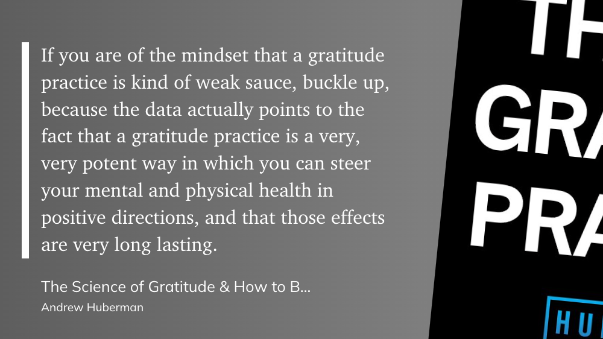

A few times each week, I sit down to reflect on a couple of meaningful moments in my gratitude journal.

**While practicing gratitude *can* lead to more ‘life experience awe,’ journaling alone isn’t enough to activate the gratitude mindset.**

Following the insights from Stanford neuroscientist, Andrew Huberman[^1], I’m switching up my routine.

## Diving into a Story of Gratitude

Huberman highlights how gratitude activates pro-social circuitry in the brain, which can ultimately lead to greater life satisfaction and bring us closer to ourselves and others.

The *most effective way* to activate a mindset of gratitude? ‘Feeling into’ a narrative centering genuine gratitude.

**Stories connect us. They make gratitude palpable.** 

To use a story in your practice 👇 

1. Select a meaningful story, where you or someone else is on the receiving end of gratitude
2. Create a cue for yourself, jotting down (a) the struggle (b) the help received (c) your emotional connection to the story
3. Spend one to two minutes a few times a week immersing yourself in the story

## Adopting Gratitude as a Habit

When it comes to making my gratitude practice into a habit, I’ll be pairing it with an existing habit—my journaling. 

In the words of James Clear[^2], ‘habit stacking’ takes advantage of existing synapses to create a cue for a new habit.

*The formula:* After/Before `existing habit`, I will `new habit`.

For me, that’s ‘After I open my gratitude journal, I will ‘feel into’ my story of gratitude.

## Embracing the structure of a gratitude practice

When I practice gratitude regularly, I find myself on the lookout for the little things that bring a sense of fullness to my life—like cuddles with my nephews and the birds chirping outside my window on a Monday morning.

There are days where it feels more routine than spontaneous, and the structure brings a sense of obligation.

At first glance, obligation feels like the enemy of gratitude. Isn’t *true* gratitude supposed to overflow from us, a natural response to blessing? Isn’t gratitude a warm and fuzzy feeling that settles over family dinners at Thanksgiving?

Not at all. The fact that we need to consciously practice our gratitude doesn’t mean it’s insincere. 

Philip Watkins[^3], professor of Psychology and researcher of the science of gratitude, theorizes that gratitude acts as an amplifier: “by experiencing and expressing gratitude, information on the goodness in one’s life is strengthened, and this is the principal reason for why gratitude enhances well-being.” In other words, our awareness of the good in our life both alerts us to the “what and who to approach to enhance happiness,” and increases our life satisfaction.

In the front of my gratitude journal, I copied a poem of Rupi Kaur’s[^4]. It reads:

>You have so much
>
>But you are always hungry for more
>
>Stop looking up at everything you don’t have
>
>And look around at everything you do
>
>\- Where the satisfaction lives

Emotions are fleeting things. If we wait until we *feel* like being grateful, we might end up bitter and pessimistic, expecting good things to fall into our laps. If we embrace the obligation of intentional practices, we strengthen our gratitude; putting in the work can result in spontaneous gratitude. Gratitude can be deeply felt *and* intentional, structured *and* meaningful. **The satisfaction lives in our gratitude.**

---
*After reading this, did you decide to create or revise your gratitude practice?*
*[Let me know!](https://twitter.com/messages/compose?recipient_id=2381079666)* 📬

[^1]: Andrew Huberman (of [Huberman Lab](https://hubermanlab.com/)) is the people’s neuroscientist. His mission is to create zero cost to consumer content that helps us optimize our routines and understand the inner workings of our nervous system. He is an incredible influence in our household and the reason why we prioritize cold/heat exposure, seek out morning light, and praise effort over performance. 
[^2]: James Clear is the author of Atomic Habits (a practical book that’s easy to read, which is why I think it’s so powerful). He has a blog post just on habit stacking [here](https://jamesclear.com/habit-stacking).
[^3]: [Philip Watkins](https://www.researchgate.net/profile/Philip-Watkins) has been studying and publishing work on gratitude for over a decade at Eastern Washington University. Quotes in this post are from his 2014 book ‘**Gratitude and the Good Life: Toward a Psychology of Appreciation**’, but he’s published several more recent studies.
[^4]: [Rupi Kaur](https://rupikaur.com/pages/about-me) is a poet and performer. Her book ‘*the sun and her flowers*’ is one of my favorite collections, which is the source of this poem.